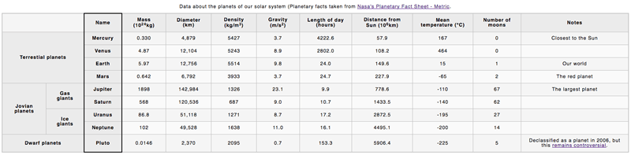

## [View Final Project](https://cdn.rawgit.com/diva-D/MDN-learn-web-development/ba7718c9/HTML/Assessment%2004%20-%20Structuring%20planet%20data/planets-data.html)

# Project Brief

You are working at a school; currently your students are studying the planets of our solar system, and you want to provide them with an easy-to-follow set of data to look up facts and figures about the planets. An HTML data table would be ideal — you need to take the raw data you have available and turn it into a table, following the steps below.

The finished table should look like this:

## Steps to complete
The following steps describe what you need to do to complete the table example. All the data you'll need is contained in the planets-data.txt file. If you have trouble visualising the data, look at the live example above, or try drawing a diagram.

1. Open your copy of blank-template.html, and start the table off by giving it an outer container, a table header, and a table body. You don't need a table footer for this example.
1. Add the provided caption to your table.
1. Add a row to the table header containing all the column headers.
1. Create all the content rows inside the table body, remembering to make all the row headings into headings semantically.
1. Make sure all the content is inserted into the right cells — in the raw data, each row of planet data is shown next to its associated planet.
1. Add attributes to make the row and column headers unambiguously associated with the rows, columns, or rowgroups that they act as headings for.
1. Add a black border just around the column that contains all the planet name row headers.