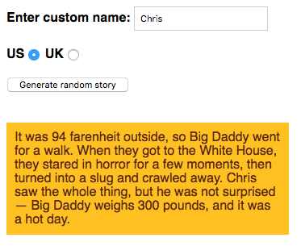

## [View Final Project](https://cdn.rawgit.com/diva-D/MDN-learn-web-development/36375600/JavaScript/Assessment%2001%20-%20Silly%20Story%20Generator/index.html)

# Project brief
You have been provided with some raw HTML/CSS and a few text strings and JavaScript functions; you need to write the necessary JavaScript to turn this into a working program, which does the following:
- Generates a silly story when the "Generate random story" button is pressed.
- Replaces the default name "Bob" in the story with a custom name, only if a custom name is entered into the "Enter custom name" text field before the generate button is pressed.
- Converts the default US weight and temperature quantities and units in the story into UK equivalents if the UK radio button is checked before the generate button is pressed.
- Will generate another random silly story if you press the button again (and again...)

The following screenshot shows an example of what the finished program should output:
